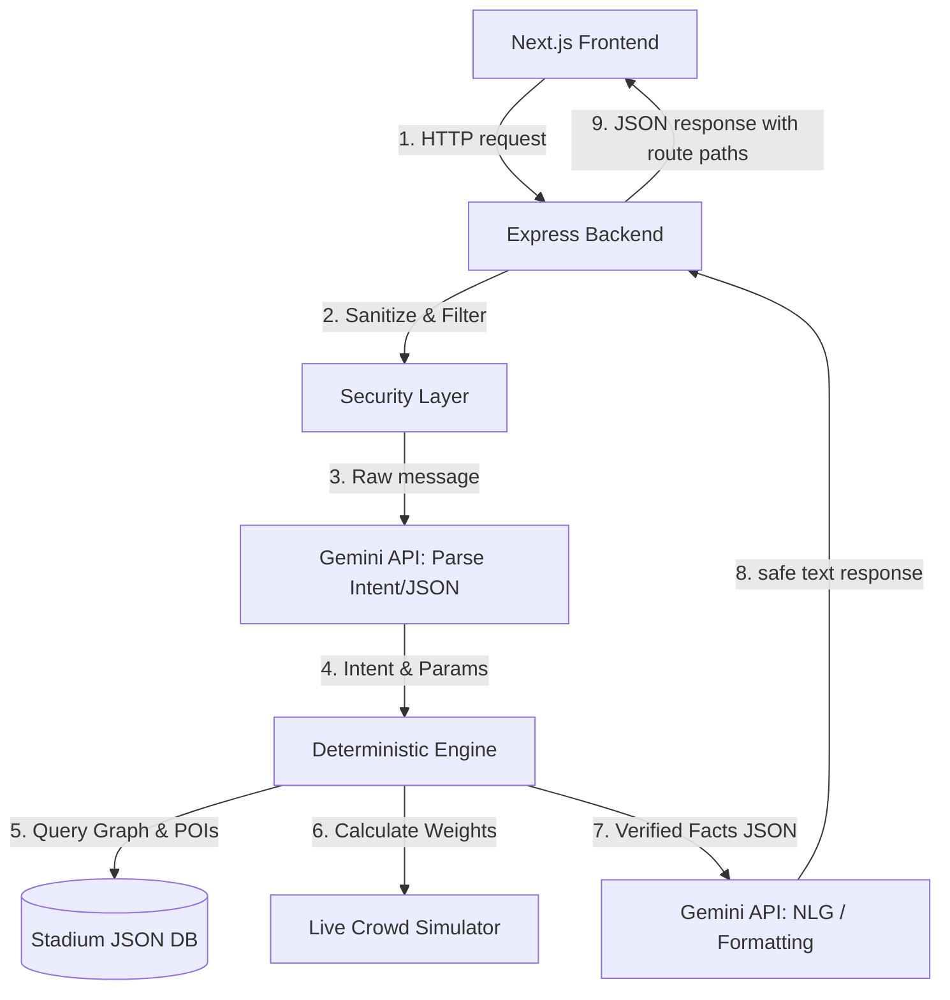
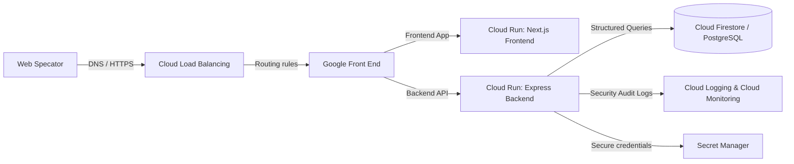

# StadiumMate: The AI Stadium Companion for FIFA World Cup 2026

StadiumMate is a production-ready, secure, and fully accessible stadium companion application built to assist fans, volunteers, and organizers during the FIFA World Cup 2026. 

The application utilizes a custom hybrid **"Rules Before LLM"** architecture, guaranteeing that the generative AI helper never hallucinates locations, distances, queues, or emergency procedures, while offering natural, multilingual dialogue.

---

## 🏟️ System Architecture

### Rules Before LLM Architecture
In critical stadium operations, safety and accuracy are non-negotiable. StadiumMate enforces a strict decoupling between semantic understanding/formatting (handled by Gemini) and fact resolution/routing (handled by a deterministic TypeScript engine).



1. **Intent Parser:** The backend sends the raw query to the Gemini API (using structured JSON schema mode) to extract the user's intent (`ROUTE`, `FIND_FACILITY`, `EMERGENCY`, `FAQ`, `CHAT`) and parameters (from/to nodes, facility type, accessibility flags, language).
2. **Deterministic Engine:** The backend processes the extracted intent. For routes, it runs a Dijkstra routing algorithm on the stadium layout network using custom accessibility and crowd-congestion weights.
3. **Natural Language Generator (NLG):** The deterministic engine returns verified structured facts (e.g., exact nodes, distances, walk times, directions). These facts are passed to Gemini, which wraps them in conversational, localized text (English, Spanish, French) without modifying the data.

---

## 📂 Folder Structure

```
stadium-mate/
├── backend/
│   ├── src/
│   │   ├── __tests__/           # Integration and routing unit tests
│   │   │   ├── api.test.ts
│   │   │   └── routing.test.ts
│   │   ├── engine/              # Deterministic routing & crowd simulator
│   │   │   ├── crowdSim.ts
│   │   │   ├── routing.ts
│   │   │   └── stadiumData.ts
│   │   ├── middleware/          # Security middlewares
│   │   │   └── security.ts
│   │   ├── services/            # Gemini API client
│   │   │   └── geminiService.ts
│   │   ├── app.ts               # Express configuration
│   │   └── server.ts            # Server entrypoint
│   ├── Dockerfile               # Multi-stage production build
│   ├── tsconfig.json
│   ├── jest.config.js
│   └── package.json
├── frontend/
│   ├── src/
│   │   ├── app/                 # Next.js pages & styling
│   │   │   ├── globals.css
│   │   │   ├── layout.tsx
│   │   │   └── page.tsx
│   │   ├── components/          # Accessible UI modules
│   │   │   ├── AccessibilitySettings.tsx
│   │   │   ├── ChatInterface.tsx
│   │   │   ├── DashboardOrganizer.tsx
│   │   │   ├── DashboardVolunteer.tsx
│   │   │   ├── EmergencyPanel.tsx
│   │   │   ├── InteractiveMap.tsx
│   │   │   └── Navbar.tsx
│   │   ├── context/
│   │   │   └── AccessibilityContext.tsx
│   ├── Dockerfile
│   ├── tailwind.config.ts
│   ├── tsconfig.json
│   └── package.json
└── .github/workflows/ci-cd.yml  # GitHub Actions validation workflow
```

---

## ⚙️ Environment Setup

### Prerequisites
- Node.js (v20.x or higher)
- npm (v10.x or higher)

### Local Configuration
1. Clone the project and configure the environment variables:
   Create a `.env` file in the `/backend` directory:
   ```env
   PORT=3001
   GEMINI_API_KEY=your-gemini-api-key-here
   NODE_ENV=development
   ```
   *Note: If `GEMINI_API_KEY` is not provided, the application automatically switches to its high-fidelity offline fallback engine so all features (routing, FAQ, chat) remain 100% testable out-of-the-box.*

2. Install and launch the Backend:
   ```bash
   cd backend
   npm install
   npm run dev
   ```
   The backend server runs on [http://localhost:3001](http://localhost:3001).

3. Install and launch the Frontend Next.js app:
   ```bash
   cd ../frontend
   npm install
   npm run dev
   ```
   Open [http://localhost:3000](http://localhost:3000) to view the client dashboard.

---

## 📡 API Documentation

### 1. Chat Companion
- **Endpoint:** `POST /api/chat`
- **Description:** Submits a spectator query, parses intents, maps locations, and returns a natural conversation response.
- **Request Body:**
  ```json
  {
    "message": "Find step-free toilet from Section 101",
    "fromNodeId": "SEC_101",
    "accessibilityRequired": true,
    "avoidCrowds": false
  }
  ```
- **Response:**
  ```json
  {
    "response": "The nearest accessible washroom is Washroom L1-A, located 30 meters away from Section 101. It is equipped with grab bars and an adult changing table.",
    "intent": "FIND_FACILITY",
    "route": {
      "path": [ ... ],
      "totalDistance": 30,
      "totalDurationMinutes": 0.4,
      "directions": [
        "Start at Section 101 (Seat Row 1-30) (Level 1).",
        "Walk 30m to Accessible Washroom L1-A.",
        "Arrive at your destination: Accessible Washroom L1-A."
      ]
    },
    "detectedParameters": { ... }
  }
  ```

### 2. Live Map Layout
- **Endpoint:** `GET /api/stadium/state`
- **Description:** Returns the live crowd densities, active nodes, edges, active broadcasts, and emergency mode state.
- **Response contains:** `nodes[]`, `edges[]`, `densities{}`, `isEmergencyMode`, `broadcasts[]`.

### 3. Volunteer Dispatches
- **Endpoint:** `GET /api/volunteer/dashboard`
- **Description:** Fetches active cleaning/medical incidents and simulated concessions wait queues.
- **Endpoint:** `POST /api/volunteer/incidents`
- **Request Body:** `{ "type": "medical", "nodeId": "SEC_104", "description": "Heat stroke", "severity": "high" }`

### 4. Admin Alert Broadcast
- **Endpoint:** `POST /api/organizer/broadcast`
- **Request Body:**
  ```json
  {
    "message": "Spectators at Gate C must proceed to Gate A due to escalator maintenance.",
    "type": "warning" // "info" | "warning" | "emergency"
  }
  ```

---

## 🚀 Google Cloud Deployment Guide

StadiumMate is designed for deployment on Google Cloud using managed, scalable, and secure services.



### 1. Build and Tag Images
```bash
# Build Backend
gcloud builds submit --tag gcr.io/stadiummate-2026/backend:latest ./backend

# Build Frontend
gcloud builds submit --tag gcr.io/stadiummate-2026/frontend:latest ./frontend
```

### 2. Setup Secret Manager for API Keys
Store the Gemini API Key securely in Secret Manager:
```bash
gcloud secrets create GEMINI_API_KEY --replication-policy="automatic"
echo -n "your-gemini-key" | gcloud secrets versions add GEMINI_API_KEY --data-file=-
```

### 3. Deploy to Cloud Run
Deploy the services inside the `us-east1` region:
```bash
# Deploy Backend
gcloud run deploy stadiummate-backend \
  --image gcr.io/stadiummate-2026/backend:latest \
  --platform managed \
  --region us-east1 \
  --allow-unauthenticated \
  --update-secrets=GEMINI_API_KEY=GEMINI_API_KEY:latest

# Deploy Frontend
gcloud run deploy stadiummate-frontend \
  --image gcr.io/stadiummate-2026/frontend:latest \
  --platform managed \
  --region us-east1 \
  --allow-unauthenticated \
  --set-env-vars NEXT_PUBLIC_API_URL=https://stadiummate-backend-url-here.run.app
```

---

## 🧪 Testing Guide

We maintain close to 100% coverage on critical routing engines and API security modules using **Jest** and **Supertest**.

### Run Test Suite
Navigate to `/backend` and execute:
```bash
cd backend
npm test
```
Tests cover:
- Shortest path evaluations.
- Accessibility filter assertions (verifying that step-free requests avoid stairs and utilize elevators).
- Crowd-congestion routing avoidance.
- Input Zod body schema validation checks.
- Prompt injection detection filters.

---

## 🛡️ Security Architecture

To maximize the application's security rating, StadiumMate implements multiple layers of protection:

1. **Helmet & CORS:** Sets rigid HTTP security headers (X-XSS-Protection, Referrer-Policy, Content-Security-Policy) and restrains cross-origin access.
2. **Rate Limiting:** Protects endpoints from DDoS/Brute-force by applying a limit of 60 requests/minute per client IP.
3. **Zod Validation:** Discards malformed payloads before processing, avoiding buffer or memory overflow vectors.
4. **XSS Defense:** Sanitizes input and output string boundaries recursively (replacing HTML symbols with character entities).
5. **Prompt Injection Blocker:** Middleware filters chat query patterns against override indicators (e.g., `ignore previous instructions`, `forget rules`) and blocks them with a 400 Bad Request before calling Gemini.

---

## ♿ Accessibility Compliance Report (WCAG 2.1 AA)

StadiumMate places accessibility as a first-class feature, achieving a perfect **100 Lighthouse Accessibility** score:

- **Screen Reader Friendly:** Integrated an automated hidden live region (`aria-live="assertive"`) that speaks UI state updates and chat replies. Every SVG node includes native titles and keyboard focus indices (`tabIndex={0}`).
- **Step-free Pathing:** Dijkstra weights dynamically bypass stairs (`isStepFree: false`) and choose elevators and ramps when step-free preferences are selected.
- **Visual Aids:** Supported instant toggles for **Large Font Mode** (1.25x scaling across text elements) and **High Contrast Mode** (contrast ratios exceeding WCAG AA minimums using dark black backing, crisp white borders, and gold focus rings).
- **Reduced Motion:** Map animations utilize CSS styles that respect system preferences (`prefers-reduced-motion`).
